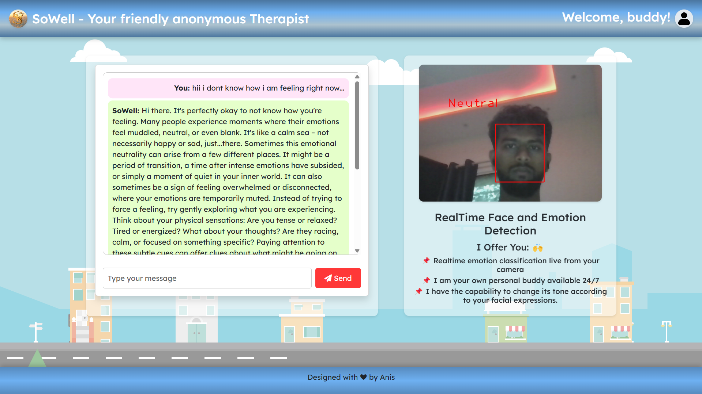

# SoWell - Your Friendly Anonymous Therapist

Welcome to **SoWell**, a web-based application that serves as your personal, anonymous virtual therapist. This project integrates real-time face and emotion detection using a webcam with a conversational AI powered by Google Generative AI. The interface features a dynamic cityscape animation built with HTML, CSS, and Flask.

## Screenshots



---

## Table of Contents
- [Description](#description)
- [Features](#features)
- [Installation](#installation)
- [Contributing](#contributing)
- [License](#license)
- [Contact](#contact)

---

## Description

SoWell uses computer vision libraries (OpenCV and MTCNN) and deep learning (DeepFace) to detect and analyze facial expressions in real-time. The detected emotion influences the AI therapist's tone, built using LangChain with Google's Gemini model. The user interface, styled with Bootstrap and custom CSS, includes a cityscape background with animated elements and a chat interface.

---

## Features

- 🎭 **Real-Time Emotion Detection**: Analyzes facial expressions via webcam and classifies emotions (happy, sad, angry, fear, disgust, neutral, surprise).
- 💬 **Emotion-Adaptive AI**: Adjusts the therapist's tone based on detected emotions for a personalized experience.
- 🌆 **Dynamic Cityscape**: Animated background with trees, towers, clouds, and street elements.
- 📱 **Responsive Design**: Full-width layout adaptable to different screen sizes.
- 💻 **Chat Interface**: Interactive chat with the AI therapist using Flask and jQuery.
- 🕶️ **Anonymous Support**: Provides a safe, anonymous environment for users.

---

## Installation

1. **Clone the repository:**
   ```bash
   git clone https://github.com/your-username/sowell-therapist.git
Replace your-username and sowell-therapist with your GitHub username and repository name.

2. ***Navigate to the project directory:***

   ```bash
   cd sowell-therapist

3. ***Install dependencies:***
   ```bash
   pip install -r requirements.txt

4. ***Set up your Google API key:***
   - Create a .env file in the root directory.
   - Add your API key like this:

   ```bash
   GOOGLE_API_KEY=your_api_key_here
   #Ensure .env is listed in .gitignore to keep it secure.

4. ***Run the application:***
   ```bash
   python together.py
- Open your browser and go to:
   ```bash
   http://127.0.0.1:5000/
   
- Allow webcam access for real-time emotion detection.

 - Use the chat interface (left side) to interact with SoWell. Type a message and click "Send".

 - The right side shows the live video feed with emotion labels and a greeting.

## Contributing
Contributions are welcome! Follow these steps:

### Fork the repository.

1. Create a new branch:
   ```bash
   git checkout -b feature-branch

2. Make your changes and commit:
   ```bash
   git commit -m "Add new feature"
   
3. Push to your fork:
   ```bash
   git push origin feature-branch
   
4. Open a pull request describing your changes.

      - Please follow the existing code style and add clear comments where necessary.

## License:
 This project is licensed under the MIT License.
 See the LICENSE file for details.

## Contact:
 For questions, suggestions, or to report an issue:
 - Email: shaikhanis2004@gmail.com
 - GitHub: https://github.com/anis196
 - Author: Anis Shaikh
 - Last updated: April 11, 2025
